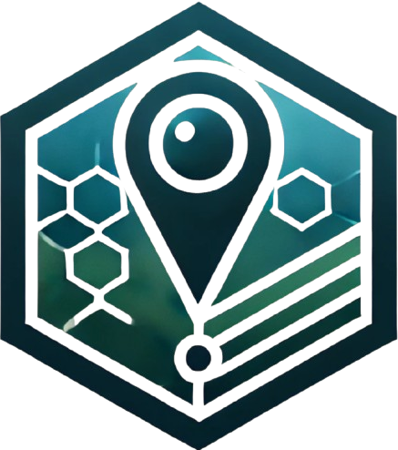
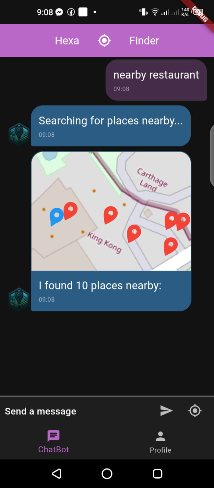
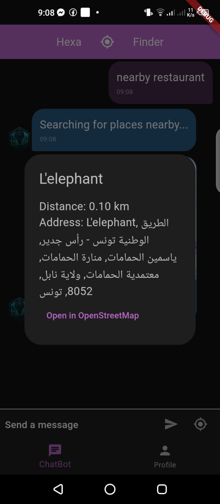
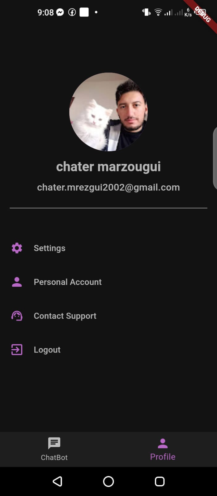
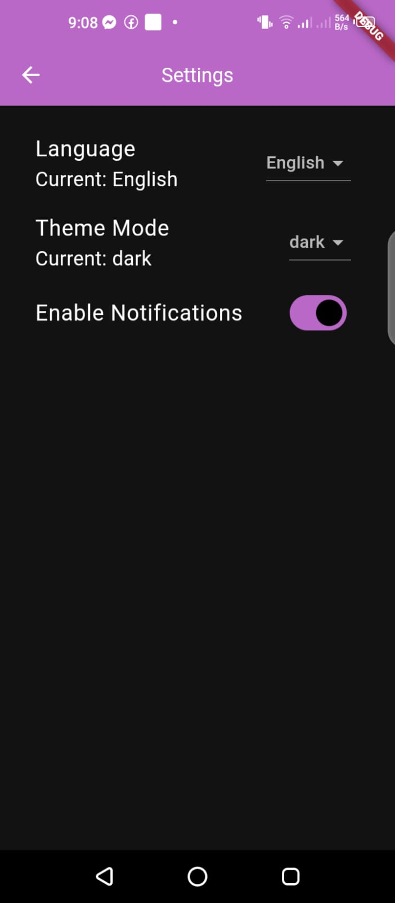
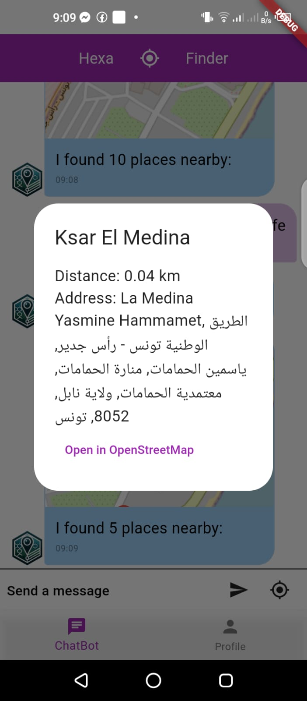
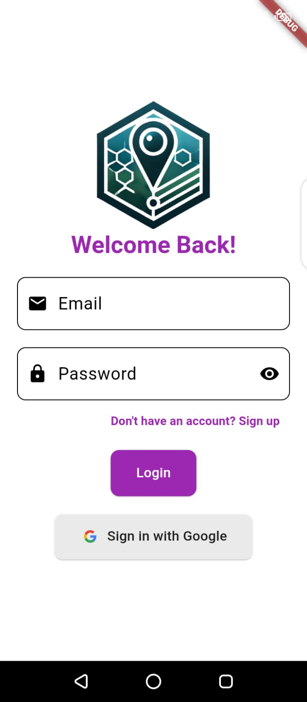
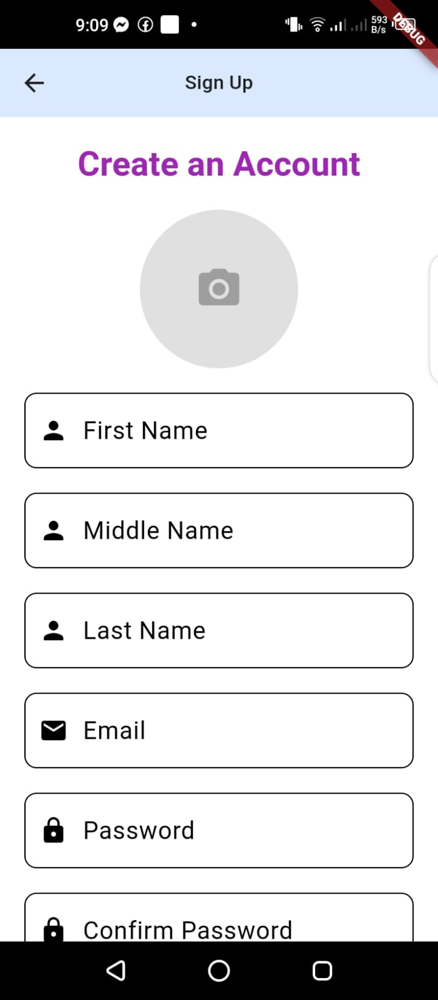

<div align="center">

[![Contributors][contributors-shield]][contributors-url]
[![Forks][forks-shield]][forks-url]
[![Stargazers][stars-shield]][stars-url]
[![Issues][issues-shield]][issues-url]
[![LinkedIn][linkedin-shield]](https://www.linkedin.com/in/chater-marzougui-342125299/)

</div>

<!-- PROJECT LOGO -->
<br />
<div align="center">
    <h1 style="font-size:35px">Hexabot Nearby Locations <br></h1>
    <br>
    <p style="font-size:20px" align="center">
        A comprehensive bipolar disorder management app designed to improve mental health and well-being.
    <br>
    <br>
    <a href="https://github.com/ahmedessouaied/TSYP12_VIVAMENTE/issues/new?labels=bug&template=bug-report---.md">Report Bug</a>
    ·
    <a href="https://github.com/ahmedessouaied/TSYP12_VIVAMENTE/issues/new?labels=enhancement&template=feature-request---.md">Request Feature</a>
  </p>
  <br><br>
  <a href="https://github.com/ahmedessouaied/TSYP12_VIVAMENTE">
    
  </a>
</div>
<br>
<br>
  
# 🗺️ Hexabot Nearby Locations, Sup'Bot submission for Orange AI Hackathon

A comprehensive location-based search solution combining a Hexabot plugin and Flutter mobile application to help users find nearby places using OpenStreetMap data.

## 🌟 Features

### Plugin Features

- 🔍 Real-time nearby place search using OpenStreetMap
- 📍 Integration with Overpass API
- 📏 Configurable search radius
- 🗺️ Direct OpenStreetMap links
- 🌐 Support for multiple amenity types
- 📊 Accurate distance calculations
- 🔄 Automatic sorting by proximity

### Mobile App Features

- 💬 Interactive chatbot interface
- 🗺️ Built-in map view using Flutter_map
- 📍 Real-time location tracking
- 🎯 Interactive place markers
- 🌙 Dark mode support
- 🔗 Deep linking to OpenStreetMap

## 📱 Screenshots

<div style="display:flex;flex-direction:column;justify-content:center;" align="center">
    <div style="display:flex;justify-content:center; gap:20px">
        
        
    </div>
    <br/>
    <div style="display:flex;justify-content:center; gap:20px">
        
        
        
    </div>
    <br/>
    <div style="display:flex;justify-content:center; gap:20px">
        
        
    </div>
</div>

## 📋 Difficulties

- Linking the application to the plugin (tried imitating the slack channel but it takes time)
- Intent training which was hard to setup, and it uses API key resources (finished in 1 hour)

## 📋 Prerequisites

### For Plugin Development

- Node.js (v14 or higher)
- npm or yarn
- Hexabot project
- Internet connection

### For Mobile App Development

- Flutter SDK (2.5.0 or higher)
- Dart SDK (2.14.0 or higher)
- Android Studio / Xcode
- Android physical device or emulator

## 🛠️ Installation

### Plugin Installation

1. Navigate to your Hexabot project plugins directory:

```bash
cd your-hexabot-project/extensions/plugins
```

2. Clone the plugin repository:

```bash
git clone https://github.com/yourusername/hexabot-plugin-nearby-places.git
```

3. Restart Hexabot project:

```bash
    hexabot stop
    hexabot dev --services ollama
```

### Mobile App Installation

1. Clone the mobile app repository:

```bash
git clone https://github.com/chater-marzougui/Sup-Bot_HexaBot-Nearby-Location.git
```

2. Install Flutter dependencies:

```bash
cd hexabot-nearby-places-app
flutter pub get
```

## ⚙️ Configuration

### Plugin Configuration

Edit `settings.ts` to configure plugin behavior:

```typescript
{
  request_location_message: "Please share your location to find places nearby.",
  error_message: "Sorry, I encountered an error while searching for nearby places.",
  search_radius: 1000  // in meters
}
```

## 📱 Usage

### Plugin Usage

Users can trigger the plugin using these commands:

```
find nearest [amenity]
nearby [amenity]
where is [amenity]
find [amenity]
```

Supported amenity types:

- restaurant
- hospital
- pharmacy
- atm
- bank
- cafe
- school
- gas station
- police
- parking

### Mobile App Usage

1. Launch the app
2. Grant location permissions when prompted
3. Type your query in the chat interface
4. View results on the integrated map
5. Tap markers for more information
6. Use "Open in OpenStreetMap" for detailed navigation

## 🗂️ Project Structure

### Plugin Structure

```
hexabot-plugin-nearby-places/
├── README.md
├── index.plugin.ts
├── package.json
├── settings.ts
└── i18n/
    └── en/
        └── title.json
```

### Mobile App Structure

```
hexabot-nearby-places-app/
├── lib/
│   ├── main.dart
│   ├── bottom_navbar.dart
│   ├── screens/
│   │   └── chatbot_screen.dart
│   │   └── profile_screen.dart
│   ├── models/
│   │   └── place.dart
│   ├── widgets/
│   │   └── chat_message.dart
│   │   └── loading_screen.dart
│   │   └── snack_bar.dart
│   │   └── widgets.dart
│   ├── controllers/
│   │   └── auth_wrapper.dart
│   │   └── user_controller.dart
│   │   └── app_preferences.dart
│   └── structures/
│       └── chat_message.dart
│       └── user_model.dart
│       └── place_model.dart
├── android/
├── ios/
└── pubspec.yaml
```

## 📦 Building for Production

### Plugin Deployment

1. Update version in `package.json`
2. Build the plugin:

```bash
npm run build
```

### Mobile App Deployment

#### Android

```bash
flutter build apk --release
```

#### iOS

```bash
flutter build ios --release
```

## 🤝 Contributing

1. Fork the repositories
2. Create feature branches
3. Submit pull requests

Please follow our coding standards and include tests.

## 👥 Credits

- OpenStreetMap data © OpenStreetMap contributors
- Overpass API
- Flutter_map package
- Hexabot platform

## 🆘 Support

- GitHub Issues
- Discord Community
- Documentation Wiki

## 🔗 Links

- [Plugin Repository](https://github.com/yourusername/hexabot-plugin-nearby-places)
- [Mobile App Repository](https://github.com/yourusername/hexabot-nearby-places-app)
- [Documentation](https://docs.yourdomain.com)
- [Community Discord](https://discord.gg/yourdiscord)
